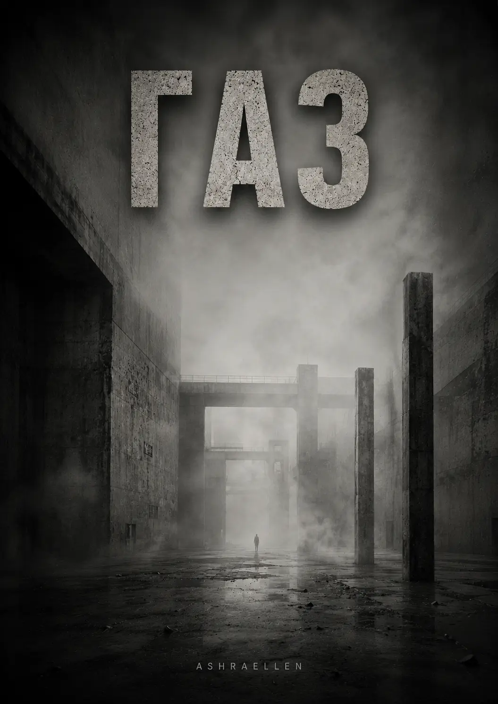

<!DOCTYPE html>

<html lang="uk">
<head>
<title>Ashraellen — ГАЗ</title>
<link href="https://www.ashraellen.com/uk/books/monolith/gas/" rel="canonical"/>
<link rel="alternate" hreflang="en" href="https://www.ashraellen.com/en/books/monolith/gas/">
<link rel="alternate" hreflang="ru" href="https://www.ashraellen.com/ru/books/monolith/gas/">
<link rel="alternate" hreflang="pl" href="https://www.ashraellen.com/pl/books/monolith/gas/">
<link rel="alternate" hreflang="be" href="https://www.ashraellen.com/be/books/monolith/gas/">
<link rel="alternate" hreflang="uk" href="https://www.ashraellen.com/uk/books/monolith/gas/">
<link rel="alternate" hreflang="de" href="https://www.ashraellen.com/de/books/monolith/gas/">
<link rel="alternate" hreflang="fr" href="https://www.ashraellen.com/fr/books/monolith/gas/">
<link rel="alternate" hreflang="es" href="https://www.ashraellen.com/es/books/monolith/gas/">
<link rel="alternate" hreflang="pt" href="https://www.ashraellen.com/pt/books/monolith/gas/">
<link rel="alternate" hreflang="fi" href="https://www.ashraellen.com/fi/books/monolith/gas/">
<link rel="alternate" hreflang="x-default" href="https://www.ashraellen.com/en/books/monolith/gas/">
<meta content="summary_large_image" name="twitter:card"/>
<meta charset="utf-8">
<meta content="width=device-width,initial-scale=1" name="viewport"/>
<link rel="stylesheet" href="../../../../assets/gas.css?v=20260813-1">

<meta content="book" property="og:type"/><meta content="Ashraellen" property="og:site_name"/><meta content="https://www.ashraellen.com/uk/books/monolith/gas/" property="og:url"/><meta content="uk_UA" property="og:locale"/>
<meta content="ГАЗ — третій, завершальний том трилогії МОНОЛІТ: роман про владу, повний контроль і втрату межі між джерелом, носієм та середовищем." name="description"/>
<meta content="Ashraellen — ГАЗ" property="og:title"/><meta content="ГАЗ — третій, завершальний том трилогії МОНОЛІТ: роман про владу, повний контроль і втрату межі між джерелом, носієм та середовищем." property="og:description"/><meta content="Ashraellen — ГАЗ" name="twitter:title"/><meta content="ГАЗ — третій, завершальний том трилогії МОНОЛІТ: роман про владу, повний контроль і втрату межі між джерелом, носієм та середовищем." name="twitter:description"/>
<meta content="ashraellen, моноліт, газ, третій том, вікторія, пліснява, влада, контроль, пам’ять, локалізація, середовище, сигнал, антиутопія" name="keywords"/>
<meta content="https://www.ashraellen.com/assets/covers/GAS_RU_COVER_final_v01.webp" property="og:image"/><meta content="https://www.ashraellen.com/assets/covers/GAS_RU_COVER_final_v01.webp" property="og:image:secure_url"/><meta content="image/webp" property="og:image:type"/><meta content="ГАЗ — російська обкладинка" property="og:image:alt"/><meta content="https://www.ashraellen.com/assets/covers/GAS_RU_COVER_final_v01.webp" name="twitter:image"/><meta content="ГАЗ — російська обкладинка" name="twitter:image:alt"/>
</head>
<body>

<header class="site-header">
Ashraellen

<a href="https://www.ashraellen.com/uk/">Вхід</a> | <a href="https://www.ashraellen.com/uk/public/">Публічне</a> | <a href="https://www.ashraellen.com/uk/books/">Книги</a> | <a href="https://www.ashraellen.com/uk/research/">Дослідження</a>
</header>
<main class="main">

<h1 class="h1">ГАЗ</h1>

Третій том МОНОЛІТУ починається там, де система ще зберігає форму, але вже втрачає право вважати себе єдиним джерелом того, що відбувається. ГАЗ перетворює розслідування Вікторії на перевірку самої межі між владою, пам’яттю, спостереженням і середовищем.

<section class="list">
<h2>Справа</h2>
Том III

Газ рідко виявляється в момент проникнення. Зазвичай його присутність стає помітною лише після того, як він уже розподілився всередині середовища.

ПРОТОКОЛ ІДЕНТИФІКАЦІЇ ОБ’ЄКТА № 2026-001B ОБ’ЄКТ: СТЕНОГРАМА «ГАЗ» (ПОВНА ВЕРСІЯ) АРХІТЕКТОР: ASHRAELLEN ІДЕНТИФІКАТОР: 2026-001B-GAS ЦІЛІСНІСТЬ: 100% (БЕЗ ЗОВНІШНЬОГО РЕДАГУВАННЯ)

<a class="btn" href="https://play.google.com/store/books/details?id=EWEAEgAAQBAJ" rel="noopener noreferrer" target="_blank">Читати російське видання в Google Play Books</a><a class="btn secondary" href="https://www.amazon.com/dp/B0HDQDVJ7G" rel="noopener noreferrer" target="_blank">Читати англійське видання на Amazon</a><a class="btn secondary" href="https://www.ashraellen.com/uk/books/monolith/">Назад до МОНОЛІТУ</a>

Відкрити повний протоколЗакрити повний протокол

ДЕПАРТАМЕНТ СМИСЛІВ

ВЕРХНІЙ СЕКТОР

УПРАВЛІННЯ КОНТРОЛЮ ПОШИРЕННЯ

ПРОТОКОЛ ІДЕНТИФІКАЦІЇ ОБ’ЄКТА № 2026-001B

ОБ’ЄКТ:

СТЕНОГРАМА «ГАЗ» (ПОВНА ВЕРСІЯ)

АРХІТЕКТОР:

ASHRAELLEN

СТАТУС:

ЗАСВІДЧЕНИЙ РУКОПИС // DIGITAL SIGNATURE: VERIFIED

РІВЕНЬ ДОСТУПУ:

СЕНСОР (SENSOR UNIT)

[ТЕХНІЧНІ ДАНІ ВЕРИФІКАЦІЇ]

ІДЕНТИФІКАТОР:

2026-001B-GAS

ПІДТВЕРДЖЕННЯ:

ЦИФРОВИЙ РЕЄСТР

ЦІЛІСНІСТЬ:

100% (БЕЗ ЗОВНІШНЬОГО РЕДАГУВАННЯ)

ІНСТРУКЦІЯ ДЛЯ СЕНСОРА:

Ви отримали доступ до цього об’єкта в межах найвищого пріоритету. Ця стенограма призначена для фіксації ознак втрати локалізації, що виникає після зникнення стійкої межі між джерелом сигналу, його носієм і середовищем поширення.

Ваше завдання як Сенсора — використовувати цей об’єкт для звірки власного положення всередині середовища. Ви зобов’язані фіксувати будь-які ознаки дифузії: неможливість встановити походження думки чи імпульсу, заміщення власної реакції реакцією середовища, зникнення відмінності між внутрішнім і зовнішнім, а також появу відчуття, ніби середовище використовує спостерігача як продовження власного контуру.

У разі виявлення фрагментів, що створюють ефект присутності без установленого джерела, зміщення точки спостереження, порушення відчуття власної локалізації або неможливості визначити, де закінчується об’єкт і починається Сенсор, який його сприймає, ви зобов’язані негайно передати звіт Архітектору офіційними каналами зв’язку.

Пам’ятайте: газ рідко виявляється в момент проникнення. Зазвичай його присутність стає помітною лише після того, як він уже розподілився всередині середовища. Він поширюється через ментальне дихання, мову, паузи, повторення й непомічену синхронізацію.

КАНАЛИ ЕКСТРЕНОГО ЗВ’ЯЗКУ:

WEB: ashraellen.com

TELEGRAM: @AshraellenLive

E-MAIL: ashraellen.live@gmail.com

ДИРЕКТИВА БЕЗПЕКИ:

Цей об’єкт призначений для тих, хто готовий зафіксувати момент, коли середовище перестає бути зовнішнім і починає використовувати спостерігача як точку власного поширення.

ЗГОДУ НА ОБРОБКУ СМИСЛІВ ОТРИМАНО АВТОМАТИЧНО.

</section>
<section class="list" id="selected-fragment">
<h2>Вибраний фрагмент</h2>
Розділ 1 / § 1.1

Розділ 1. Інвентаризація тіней § 1.1. Виворіт дзеркала

Відкрити вибраний фрагментЗакрити вибраний фрагмент

Ранок у Верхньому Покої починався не зі світла.

Спочатку приходив запах.

Суха суміш воску, старої тканини, ліків і каменю. Потім — звук: приглушені кроки, короткі команди, шелест щіток. І лише після цього вузькі високі вікна пропускали всередину бліде ранкове світло, яке ковзало по стінах так обережно, ніби йому теж було потрібне погодження.

Вікторія йшла коридором повільніше, ніж зазвичай.

Верхній Покой завжди здавався їй не житловим простором, а декорацією, у якій кожен предмет був поставлений не для зручності, а для підтримання версії світу.

Два охоронці біля дверей головної спальні випросталися, коли вона підійшла.

— Відкрийте.

Замок клацнув.

Спальня зустріла її напівтемрявою, тишею і масою. Над ліжком висів важкий балдахін, стіни були затягнуті тканиною, меблі стояли на своїх місцях із тією точністю, яку можна досягти тільки тоді, коли ніхто ними не користується.

Господар спав.

Або робив вигляд, що спить.

Вікторія зупинилася біля ліжка.

У цьому світлі обличчя виглядало старішим, ніж на екранах. Шкіра провисала там, де її вже не підтримувала звична публічна маска. Біля рота лежала тонка темна тінь. Під очима — набряк.

За кілька годин усе це буде виправлено.

Тіні приберуть.

Колір вирівняють.

Лінію підборіддя підтягнуть світлом.

Голос очистять.

Біологія ще раз поступиться міфу.

Вікторія дивилася на нього довше, ніж дозволяла собі зазвичай.

Потім підійшла до стіни навпроти ліжка.

Там висів старий гобелен із геометричним орнаментом.

За ним була двері.

Не декоративна.

Броньована.

Вона приклала перепустку до прихованого зчитувача.

Панель коротко спалахнула.

Двері відчинилися.

За нею починався вузький стерильний коридор, облицьований білим композитом.

Ніяких килимів.

Ніяких портретів.

Ніякої історії.

Тільки світло, вентиляція і п’ять однакових дверей.

Вікторія пройшла до четвертої.

Всередині було світло.

На ліжку сидів Пліснява.

Справжній.

Без гриму, без публічної постави, без тієї тяжкої повільності, яку він демонстрував перед камерами.

Він тримав у руках чашку кави.

— Рано.

— Уже ні.

— Для чого?

— Для всього.

Він усміхнувся.

Вікторія не відповідала на усмішку.

Пліснява давно перестав сприймати її як людину, якій потрібно щось пояснювати. Вона була частиною механізму, зручним константним елементом, який не ставив зайвих питань.

До останнього часу.

— Піднімайте 001-02.

— Другого?

— Так.

— Він учора працював.

— Я знаю.

— Тоді чому не Третій?

Вікторія подивилася на нього.

— Тому що Третій сьогодні потрібен на північному маршруті.

Пліснява поставив чашку.

— А Перший?

— Перший нестабільний.

— Знову?

— Так.

Він тихо вилаявся.

Вікторія підійшла до стіни, де горіла схема п’яти дверей.

За кожною був той самий чоловік.

Принаймні так повинно було здаватися.

Один спав.

Другий учора відпрацював публічний день.

Третій готувався до маршруту.

Четвертий проходив корекцію.

П’ятий був резервом.

Справжній сидів тут і пив каву.

— Другий знову бачить сни.

— Які?

— Ті самі.

Пліснява не перепитав.

Вікторія відкрила картку 001-02.

— Каже, що прокидається в кімнаті, якої немає.

— І?

— Там немає стін.

— Це проблема лікарів.

— Не тільки.

— Чому?

Вікторія збільшила останній запис.

— Він використовує слово «газ».

Пліснява повільно підняв очі.

— Хто йому його дав?

— Ніхто.

— Тоді звідки?

— Саме тому я тут.

Кілька секунд вони мовчали.

Потім Пліснява сказав:

— Приберіть Другого.

— Куди?

— Куди завгодно.

— Це не вирішить проблему.

— Вирішить.

— Ні.

Він нахмурився.

— Ви почали сперечатися.

— Я почала фіксувати.

— Це одне й те саме?

— Поки ні.

Пліснява дивився на неї уважно.

Вікторія відчула, що в цю мить щось змінилося.

Не в ньому.

У самій конфігурації кімнати.

Ніби вона перестала бути частиною системи й на кілька секунд опинилася зовні.

А потім зрозуміла, що зовні не було.

Ніколи.

Вона закрила картку.

— Я підніму Третього.

— Ви сказали — Другого.

— Передумала.

Пліснява усміхнувся без задоволення.

— Ось тепер це вже точно проблема.

Вікторія вийшла в коридор.

П’ять дверей стояли перед нею.

П’ять однакових точок входу.

І вперше вона подумала не про те, хто з них сьогодні буде Господарем.

Вона подумала, скільки з них уже вважають себе ним.

</section>
<section class="list" id="about">
<h2>Про книгу</h2>
без переказу сюжету

ГАЗ продовжує лінію БЕТОНУ та ЖИЖІ, але змінює сам спосіб спостереження за системою. Якщо перший том показував форму, а другий — її внутрішню деформацію, то третій переносить увагу на те, що відбувається після втрати герметичної межі.

Влада тут залишається не лише політичною чи адміністративною категорією. Вона працює через образ, пам’ять, ритуал, заміну, повторення, контроль версії й керування тим, що саме вважається допустимим сприйняттям реальності.

Вікторія більше не просто спостерігає за механізмом. Саме її положення всередині нього стає предметом перевірки.

Глибоко всередині всього цього залишається ім’я людини, яка колись була частиною Моноліту, а потім перестала бути чимось, що система могла втримати.

ГАЗ — роман про владу, повний контроль і момент, коли середовище починає використовувати спостерігача як продовження власного контуру.

</section>
<section class="list" id="object-status">
<h2>Статус об’єкта</h2>
2026-001B-GAS

СТАТУС: АКТИВНИЙ

СТАДІЯ СИГНАЛУ: РОЗПОДІЛ

ЛОКАЛІЗАЦІЯ ДЖЕРЕЛА: НЕ ПІДТВЕРДЖЕНА

ПРИМІТКА: цитування, переказ і повторення можуть розглядатися як форми вторинного поширення.

ПРИМІТКА ДЛЯ СЕНСОРА: деякі тексти не призначені для читання лише як художній вимисел. Перевіряйте здатність зберігати межу між собою й середовищем, у якому відбувається читання.

</section>
<section class="list" id="from-author">
<h2>Від автора</h2>
коротка рамка

Ця книга не просить читача «розгадати» приховану систему. Вона пропонує спостерігати, як система виробляє умови, у яких саме питання про джерело може виявитися запізнілим.

Мені важливо було залишити читачеві не готову відповідь, а робочу напругу між тим, що видно, тим, що повторюється, і тим, що вже стало частиною середовища.

</section>
<section class="list" id="spoiler-free">
<h2>Без спойлерів</h2>
що можна знати до читання

Вікторія продовжує працювати всередині системи Верхнього Сектора.

Її розслідування поступово виходить за межі одного інциденту й ставить під сумнів саму можливість чітко відокремити спостерігача від об’єкта спостереження.

Чим далі вона просувається, тим менш надійним стає припущення, що сигнал має одне джерело, одного носія й один канал.

</section>
<section class="list" id="research-frame">
<h2>Художньо-дослідницька рамка</h2>
fiction / observation

ГАЗ можна читати як антиутопічний роман і психологічний трилер. Водночас внутрішня архітектура книги використовує мову протоколів, спостереження й реєстрації як художній інструмент.

Це не документальний звіт і не твердження про приховані зовнішні механізми. Дослідницька функція полягає в іншому: роман моделює ситуацію, у якій читачеві доводиться стежити не лише за подіями, а й за власним способом встановлювати межу між джерелом, носієм і середовищем.

Саме тому службові формули, реєстри й протоколи тут працюють одночасно як частина світу роману й як спосіб організації читання.

</section>
<section class="list" id="themes">
<h2>Смислові вузли</h2>
6 напрямків

<article class="gas-card"><h3>Влада</h3>
Система утримує не тільки територію чи рішення, а й образ того, що вважається реальністю.
</article><article class="gas-card"><h3>Пам’ять</h3>
Спогад стає не приватною власністю, а полем перевірки, корекції та повторного присвоєння.
</article><article class="gas-card"><h3>Спостерігач</h3>
Позиція того, хто фіксує події, перестає бути нейтральною і сама потрапляє всередину експерименту.
</article><article class="gas-card"><h3>Межа</h3>
Внутрішнє й зовнішнє більше не розділяються надійною стіною; проблема локалізації стає центральною.
</article><article class="gas-card"><h3>Джерело</h3>
Подія може з’являтися раніше за встановлене джерело.
</article><article class="gas-card"><h3>Поширення</h3>
Мова, паузи, повторення й синхронізація стають каналами середовища, яке неможливо втримати стіною.
</article>
</section>
<section class="list" id="registry">
<h2>Реєстр смислів</h2>
15 розділів / 45 параграфів

<article class="gas-card registry-card"><h3>Розділ 1. Інвентаризація тіней</h3>
§ 1.1. Виворіт дзеркала

§ 1.2. Голоси в контурі

§ 1.3. Сліди витоку
</article><article class="gas-card registry-card"><h3>Розділ 2. Шви обличчя</h3>
§ 2.1. Спуск до узгодження

§ 2.2. Матеріал утомлюється

§ 2.3. Неврахована глибина
</article><article class="gas-card registry-card"><h3>Розділ 3. Тихий допуск</h3>
§ 3.1. Повернення у верхній контур

§ 3.2. Перший обхід без доручення

§ 3.3. Те, про що не доповідають
</article><article class="gas-card registry-card"><h3>Розділ 4. Витрата</h3>
§ 4.1. Матеріал зовні

§ 4.2. Слід без носія

§ 4.3. Горизонталь
</article><article class="gas-card registry-card"><h3>Розділ 5. Аварійний контур</h3>
§ 5.1. Зрив корекції

§ 5.2. Причина для звіту

§ 5.3. Мова для викиду
</article><article class="gas-card registry-card"><h3>Розділ 6. Погляд середовища</h3>
§ 6.1. Повтор без збігу

§ 6.2. Келія після екрана

§ 6.3. Маленька спальня при кабінеті
</article><article class="gas-card registry-card"><h3>Розділ 7. Слід без події</h3>
§ 7.1. Газ починає ліпити

§ 7.2. Блок 4-Б

§ 7.3. Непротокольний залишок
</article><article class="gas-card registry-card"><h3>Розділ 8. У межах мовчання</h3>
§ 8.1. Микола

§ 8.2. Ім’я, що залишилося внизу

§ 8.3. Сіре поле
</article><article class="gas-card registry-card"><h3>Розділ 9. Карта без носія</h3>
§ 9.1. Контур спостереження

§ 9.2. Знятий маршрут

§ 9.3. Утримання об’єкта
</article><article class="gas-card registry-card"><h3>Розділ 10. Розширення контуру</h3>
§ 10.1. Слід, що не загоюється

§ 10.2. Маршрути уваги

§ 10.3. Пауза біля знятого маршруту
</article><article class="gas-card registry-card"><h3>Розділ 11. Клітка без стін</h3>
§ 11.1. Перше коло

§ 11.2. Людина з диханням раніше за себе

§ 11.3. Клітка без стін
</article><article class="gas-card registry-card"><h3>Розділ 12. Стан спостерігача</h3>
§ 12.1. Кімната прямого спостереження

§ 12.2. Збій ролей

§ 12.3. Режим допуску
</article><article class="gas-card registry-card"><h3>Розділ 13. Зовнішній об’єкт</h3>
§ 13.1. Чистий контур

§ 13.2. Відповідь без адреси

§ 13.3. Примусова адреса
</article><article class="gas-card registry-card"><h3>Розділ 14. Допустимий вхід</h3>
§ 14.1. Перший сигнал

§ 14.2. Контакт за допуском

§ 14.3. Свідоцька затримка
</article><article class="gas-card registry-card"><h3>Розділ 15. Вхід</h3>
§ 15.1. Остання секунда

§ 15.2. Вхід був у тобі

§ 15.3. Ім’я, яке можна витримати
</article>
</section>
<section class="list" id="for-whom">
<h2>Для кого ця книга</h2>
читацький вхід

Для читачів антиутопії, філософської прози й психологічного трилера, яким цікава влада не лише як апарат примусу, а й як система контролю образу, пам’яті, мови та допустимого сприйняття.

Для тих, кому важливі історії, де розслідування поступово змінює положення самого спостерігача, а головний конфлікт проходить не лише між людиною й системою, а й через питання, чи можна зберегти власну межу всередині середовища.

</section>
<section class="list" id="place-in-trilogy">
<h2>Місце в трилогії</h2>
МОНОЛІТ / Том III

ГАЗ — третій і завершальний том МОНОЛІТУ після БЕТОНУ та ЖИЖІ.

У рамці самого видання він позначений як завершальна стадія сигналу, вперше зафіксованого в Томі I об’єкта № 2026-001B і такого, що пройшов внутрішню розгерметизацію в Томі II.

БЕТОН утримує форму. ЖИЖА показує її внутрішню деформацію. ГАЗ починається там, де стійкої межі вже недостатньо навіть для того, щоб надійно розрізнити джерело, носій і середовище поширення.

</section>
<section class="list" id="editions">
<h2>Де читати / видання</h2>
актуальні доступні посилання

<a class="btn" href="https://play.google.com/store/books/details?id=EWEAEgAAQBAJ" rel="noopener noreferrer" target="_blank">Читати російське видання в Google Play Books</a><a class="btn secondary" href="https://www.amazon.com/dp/B0HDQDVJ7G" rel="noopener noreferrer" target="_blank">Читати англійське видання на Amazon</a><a class="btn secondary" href="https://www.ashraellen.com/uk/books/monolith/">Назад до серії МОНОЛІТ</a>

</section>
<section class="list" id="boundaries">
<h2>Що важливо не плутати</h2>
межі об’єкта

ГАЗ — не історія про містичну силу, яка просто приходить ззовні. Внутрішня логіка книги навмисно не дозволяє звести те, що відбувається, до одного зручного джерела.

Зникнення стійкої форми тут не дорівнює звільненню. Розгерметизація руйнує звичну архітектуру контролю, але водночас позбавляє спостерігача колишніх координат і безпечної зовнішньої позиції.

І це не буквальна інструкція з пошуку «прихованих сигналів» поза романом. Протокол, Сенсор, Архітектор і Об’єкт утворюють внутрішню мову книги й перетворюють читання на художній експеримент із положенням спостерігача.

</section>
<section class="list" id="apocrypha">
<h2>Сигнал</h2>
Апокриф / Неврахований фрагмент № 0

Якщо смислу потрібен носій, чому ти почув це раніше, ніж прочитав?

Відкрити неврахований фрагмент № 0Закрити неврахований фрагмент № 0

[REF: 2026-001B] // [SECTOR: UPPER_NULL] // [STATUS: DECLASSIFIED]

АПОКРИФ

НЕВРАХОВАНИЙ ФРАГМЕНТ № 0

ДЖЕРЕЛО:

НЕ ВСТАНОВЛЕНО

НОСІЙ:

ВІДСУТНІЙ

ЧАС РЕЄСТРАЦІЇ:

ДО МОМЕНТУ ПОЯВИ ЗАПИСУ

СТАТУС:

НЕ ПІДЛЯГАЄ ВКЛЮЧЕННЮ ДО РЕЄСТРУ

Перше повідомлення виявив Сенсор 14.

Він не бачив, як воно з’явилося.

Екран був порожній. Потім він відвернувся до вікна, почув короткий сигнал і знову подивився на термінал.

На екрані стояв один рядок:

Якщо смислу потрібен носій, чому ти почув це раніше, ніж прочитав?

Сенсор 14 викликав чергового.

Черговий прочитав рядок, перевірив журнал введення й повідомив, що термінал не отримував даних протягом останніх семи годин.

— Отже, локальний збій.

— Ні.

— Чому?

Сенсор 14 відповів не одразу.

— Я знав, що там буде написано.

Рядок видалили.

Через дванадцять хвилин той самий текст виявили на паперовому бланку в Секторі Узгодження.

Принтер був вимкнений.

Бланк лежав у закритому лотку серед сорока двох чистих примірників.

На жодному іншому аркуші слідів друку не було.

Папір вилучили.

Через три хвилини Сенсор 8 повідомив, що бачив цю фразу раніше.

Його попросили вказати джерело.

Він сказав:

— Не пам’ятаю.

Йому показали фотографію бланка.

Він похитав головою.

— Ні. Не це.

— Що означає «не це»?

— Я її не читав.

— Тоді звідки ти її знаєш?

Сенсор 8 довго дивився на фотографію.

— Я думав її вчора.

Запис перевели в режим внутрішнього розслідування.

Перевірка пам’яті Сенсора 8 не виявила контакту із Сенсором 14, Сектором Узгодження, архівом інциденту або системами, у яких був присутній фрагмент.

Розслідування розширили.

До кінця доби зареєстрували дев’ять збігів.

У двох випадках фраза з’явилася на екранах.

В одному — у службовій записці між рядками затвердженого тексту.

У трьох випадках сенсори повідомили, що згадали її.

Ще двоє стверджували, що знали фразу з дитинства.

Один відмовився відповідати.

Його запитали чому.

Він сказав:

— Тому що ви вже вирішили, що вона звідкись прийшла.

— А звідки вона прийшла?

— Ось.

— Що — ось?

Він торкнувся пальцем скроні.

— Ваше запитання.

Після цього до картки інциденту додали поле:

ДЖЕРЕЛО:

НЕ ВСТАНОВЛЕНО

Потім:

НОСІЙ:

НЕ ВСТАНОВЛЕНО

Потім:

КАНАЛ:

НЕ ВСТАНОВЛЕНО

Через годину система автоматично змінила другий рядок.

НОСІЙ:

НЕ ПОТРІБЕН

Виправлення скасували.

Воно з’явилося знову.

Тоді картку вивели із загального контуру й перенесли на автономний термінал без підключення до мережі.

На автономному терміналі рядок змінився ще раз.

ДЖЕРЕЛО:

НЕ ПОТРІБНЕ

Черговий спеціаліст зробив знімок екрана.

Після проявлення з’ясувалося, що фотографія містить інший запис:

Ви продовжуєте шукати місце, звідки це прийшло.

Так ви не помічаєте місця, куди це прийшло.

Комісія наказала знищити термінал.

Перед вимкненням живлення оператор побачив, що в картці з’явилося нове поле.

АДРЕСА:

ВСТАНОВЛЕНА

Він не встиг прочитати значення.

Принаймні так він зазначив у звіті.

Через два дні поле виявили в архівній копії документа.

Архівну копію було створено за шість років до події.

У ній не було відомостей про джерело, носія й канал.

Залишався лише останній рядок.

АДРЕСА:

СПОСТЕРІГАЧ

</section>

— mark of presence

</main>

</body>
</html>
